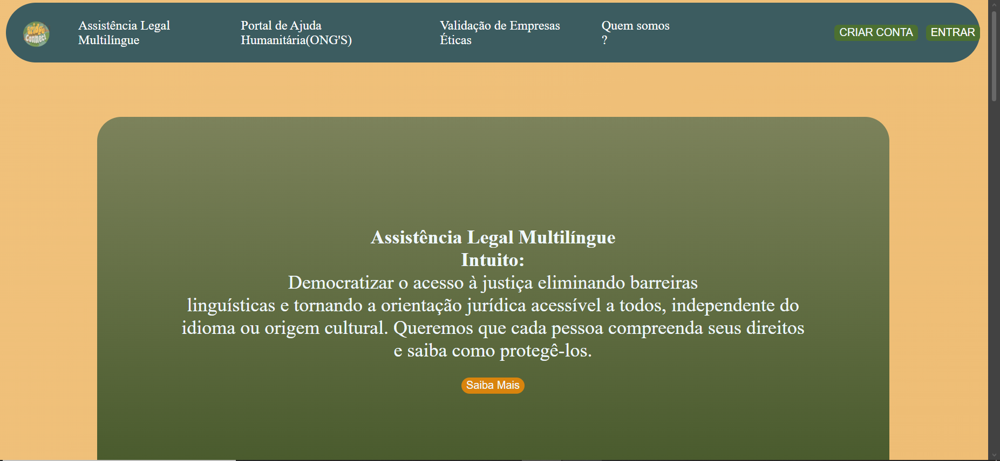
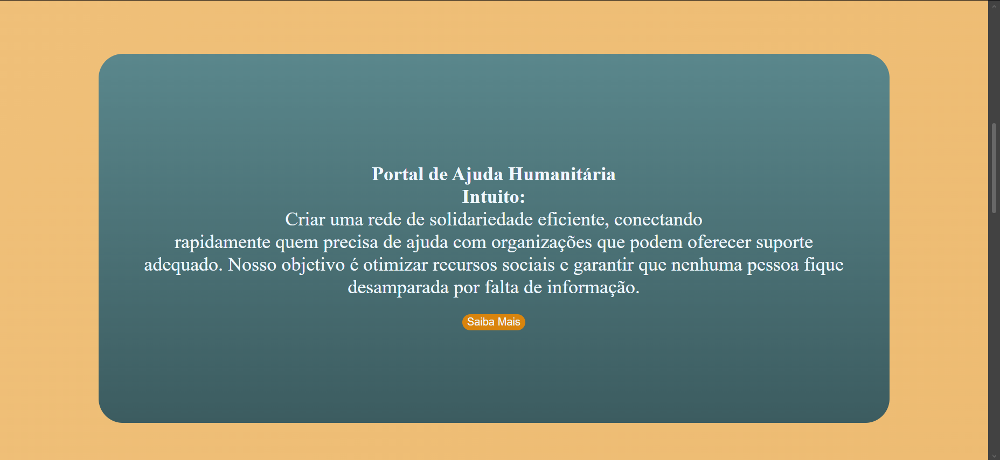
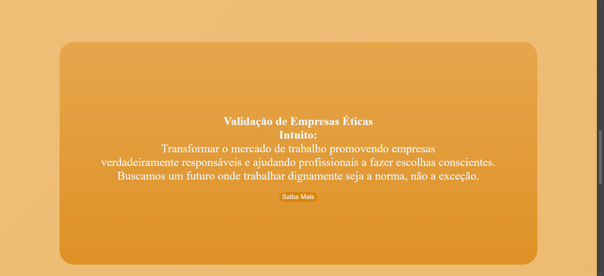
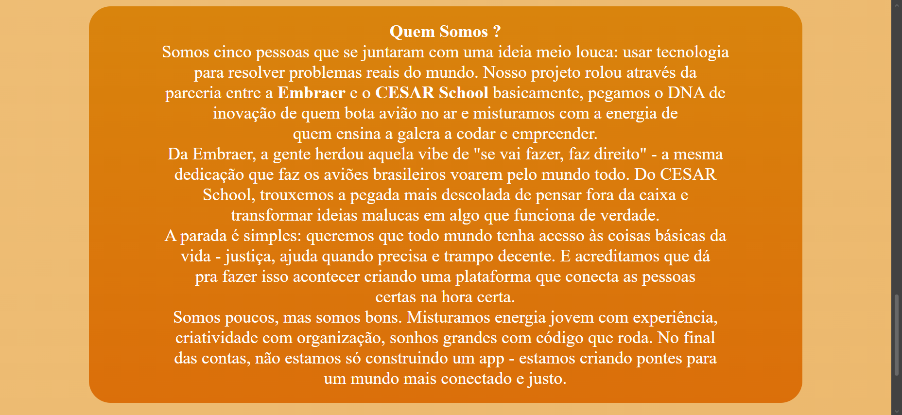
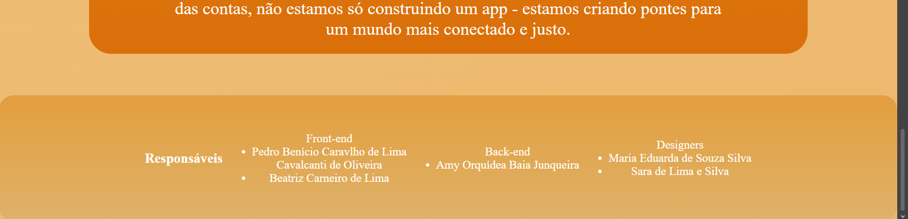
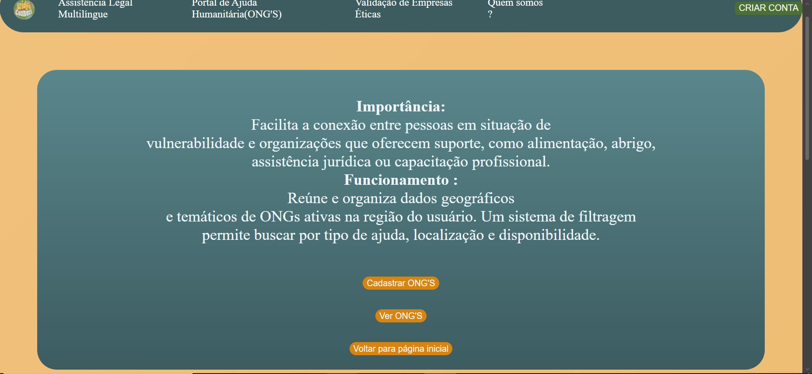
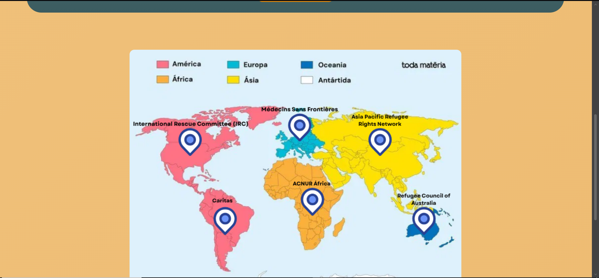
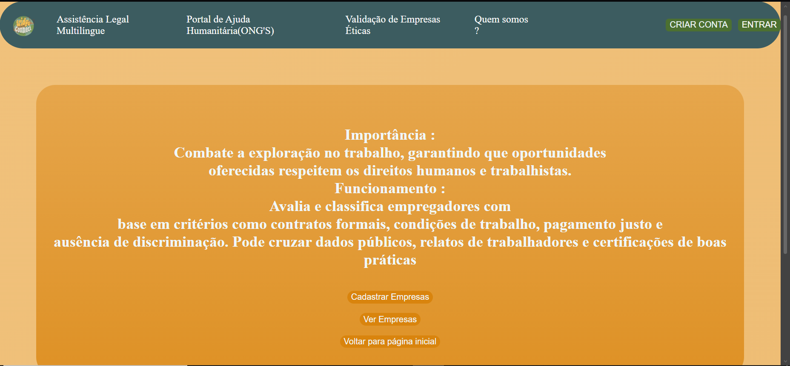

# Bridge Connect
### Um projeto feito dentro de dois dias, em um hackathon do CESAR School. Consiste em tentar diminuir uma problemática específica, com o tema sendo desigualdade social (ODS 10). 
> [!NOTE]
> Nossa equipe ficou em segundo lugar!
> 
> O sistema foi feito utilizando o framework Flask, consistindo em ser um sistema que auxilie imigrantes a encontrar vagas de emprego mais próximas de si, com um mapa determinando em quais locais existem essas empresas e ongs, além de ter advogados que poderão ajudar essas pessoas.

# Interface do Sistema
## Index
O index possui bastante informação sobre cada parte do site, sendo possível ver a área de empresas, advogados e ongs; além de explicar um pouco sobre o projeto. A última foto também é um fragmento que está em todo o site, dizendo quem foram os colaboradores do projeto e suas funções.

#

## Assistência Legal
Esta aba conta a ideia principal de como seria se o projeto seguisse em frente, além de ser possível adicionar advogados ao banco de dados, os listar e listar os usuários.

### Cadastro de Advogados

### Lista de Advogados

### Lista de Usuário

>[!NOTE]
>
>O formulário de usuário e de Advogados são praticamente os mesmos. Logo abaixo irei mostrar o formulário direto no editar e a diferença após a edição, é possível ver que o excluir funciona ao prestar atenção na segunda imagem, onde um dos usuários não está mais listado. A terceira imagem é a quando tenta cadastrar quando o email já está cadastrado.

### Edição de Usuário

### Erro de Usuário Existente

#

## Portal de Ajuda
Esta aba conta sobre como funcionaria se o sistema seguisse em frente, no geral serviria para mostrar ongs mais próximas o usuário para o auxiliar. Logo abaixo possui um mapa meramente ilustrativo, uma forma de demonstrar como alertaria pro usuário. Além disso é possível adicionar e listar as Ongs que fazem parceria com o site.

### Cadastro de Ongs

### Listagem de Ongs

#

## Empresas
Esta aba serve para explicar somo funcionaria as parcerias com empresas, num geral elas poderiam adicionar vagas de emprego para que os usuários possam se candidatar de forma mais fácil, principalmente pela empresa estar sendo aliada a causa. Aqui é possível cadastrar e listar as empresas no banco.

### Cadastro de Empresas

### Listagem de Empresas

